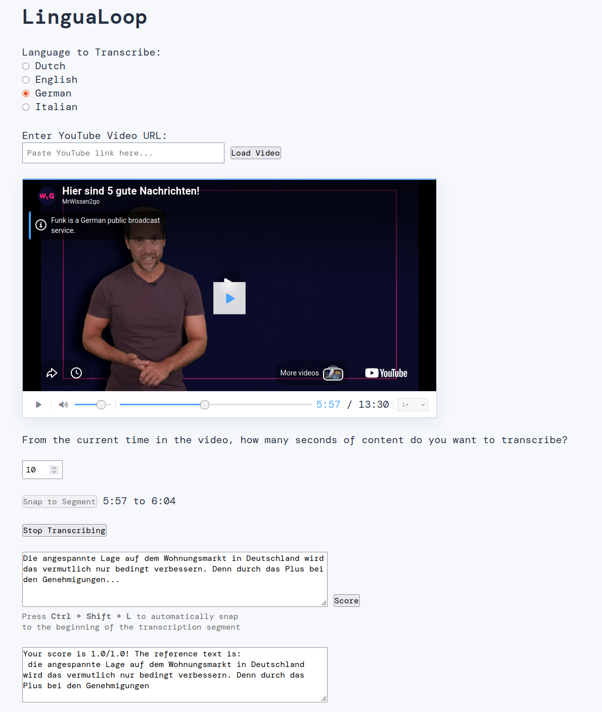

Welcome to lingua-loop's documentation!
=========================================

A web application to train your listening skills by transcribing real speech
from YouTube videos.

Installation
============

You need Python version 3.12 or higher. It's recommended to create a dedicated
virtual environment first.

Using conda:

.. code-block:: bash

   conda create --name lingua-loop python=3.12
   conda activate lingua-loop

Using venv on Windows:

.. code-block:: bat

   python -m venv .venv_lingua_loop
   .\.venv_lingua_loop\Scripts\activate

Using venv on Linux/macOS:

.. code-block:: bash

   python -m venv .venv_lingua_loop
   . .venv_lingua_loop/bin/activate

Then install the package:

.. code-block:: bash

   pip install lingua-loop

The package is also installable directly from the repository:

.. code-block:: bash

   pip install git+https://github.com/jfdev001/lingua-loop.git

For a faster install using the ``uv`` package manager:

.. code-block:: bash

   uv pip install git+https://github.com/jfdev001/lingua-loop.git

.. note::
   This package is under active development and updated frequently.

Usage
=====

Launch the app (which will open a web browser automatically):

.. code-block:: bash

   lingua-loop

.. toctree::
   :maxdepth: 1
   :caption: Contents:

   api
   schemas
   services
   db
   exceptions
   integrations

Indices and tables
==================

* :ref:`genindex`
* :ref:`modindex`
* :ref:`search`
